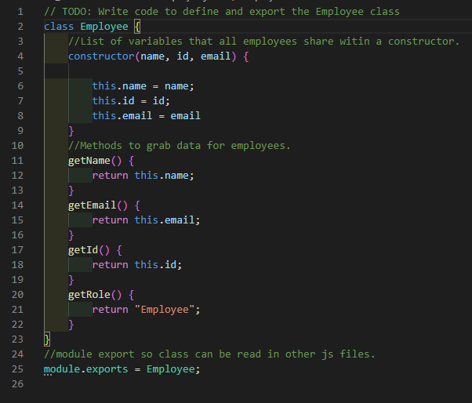

# TeamProfile_Generator
  
  ## Description 
  App that uses the command line to prompt the user for information about team members. It then generates the users software engineering team.
  ## Table of Contents:
  - [Installation](#Installation)
  - [Usage](#Usage)
  - [License](#License)
  - [Contributing](#Contributing)
  - [Tests](#Tests)
  - [Questions](#Questions)
  ## Installation
  Make sure Node is installed on your machine and use "npm install" into the command line to install all dependencies."
  ## Usage
  User will answer prompts to provide info about each employee on his team.  Once the user is done, an html file can be generated by picking the "Stop adding employees to team" option.  The file will then generate an html with cards that contain the information for each employee on the user's team.
  
  
  
  
  
  
  
  
  
  
  
  
  ## License
  MIT
  ## Contributing
  
  ## Tests
  
  ## Questions
  For any questions, [mailto:alexisayyid@gmail.com], or visit my [GitHub] (https://github.com/aisayyid) 
 
