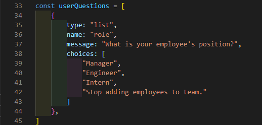
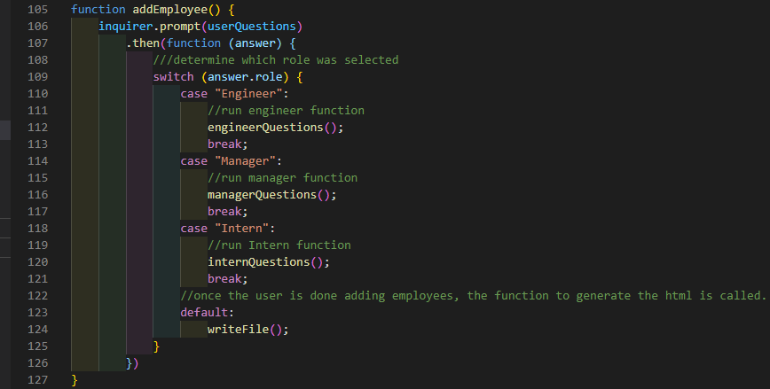
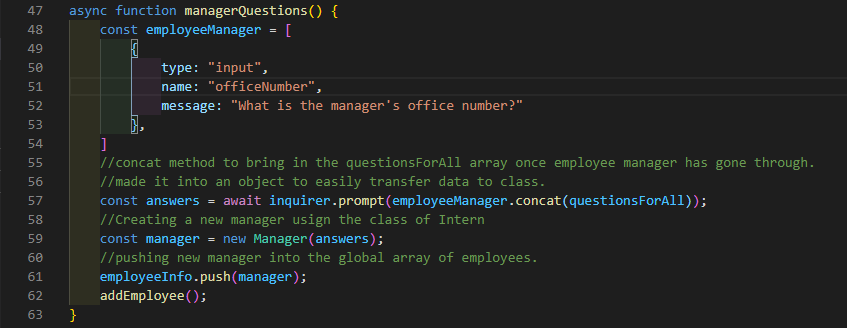
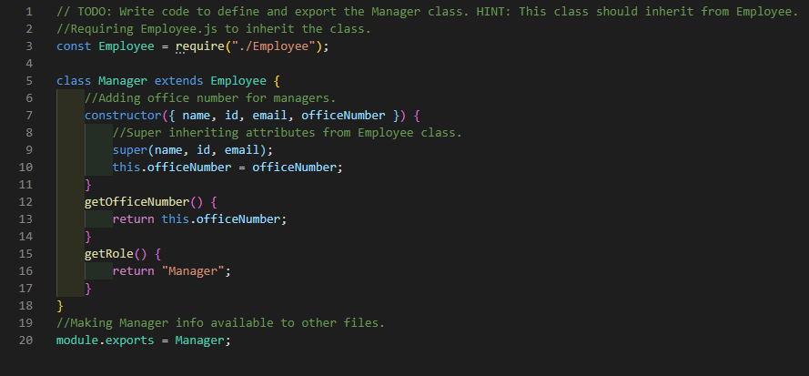
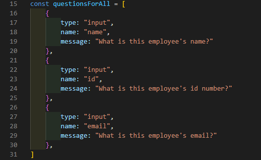
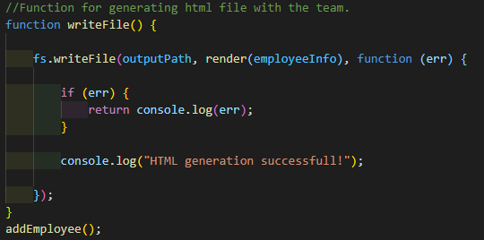

# TeamProfile_Generator
  
  ## Description 
  App that uses the command line to prompt the user for information about team members. It then generates the users software engineering team.
  ## Table of Contents:
  - [Installation](#Installation)
  - [Usage](#Usage)
  - [License](#License)
  - [Contributing](#Contributing)
  - [Tests](#Tests)
  - [Questions](#Questions)
  ## Installation
  Make sure Node is installed on your machine and use "npm install" into the command line to install all dependencies."
  ## Usage
  User will answer prompts to provide info about each employee on his team.  Once the user is done, an html file can be generated by picking the "Stop adding employees to team" option.  The file will then generate an html with cards that contain the information for each employee on the user's team.
  
  - Once the user runs the app, it will ask him to pick a type of emplyee, using the lists from inquirer.
  
  
  
  - Once the user picks the type of employee he would like to add, a switch method is used to run a function specific to that type of employee.
  
  
  
  - So if that employee was a manager, it would run the manager function.  This function contains a specific question for a manager role.  The answer is then concatinated to the questionforAll function, which asks for information that all employees have in commmon. Using the async await method, the functions run one after another instead of the same time, which would cause multiple questions to be asked at once if not used.  A new Manager is then  created using the Manager subclass, which is tied to the Employee Class.  Once the new role is created it is pushed to a global array called employeeInfo.  Finally, it calls the addEmployee function which contains the switch method, which loops us back to the first prompt.
  
  
  
  
  
  
  
  
  
  - The array concat method used in the manager/engineer/internQuestions functions then leads to these prompts.
  
  
  
  - Once the user is done adding employees by choosing the "stop adding employees to team" choice in the first prompt, it runs the default in the switch method, which calls the writeFile function.  The function uses global variables that set the output path, and set a render function which hooks up the html file which calls all the methods that grabbed info from the users responses within the Employee class and its subclasses that will generate the html using the global array of employeeQuestions, which contains all the employees added to the team.
  
  
 
 ## License
  MIT
  ## Contributing
  
  ## Tests
  
  ## Questions
  For any questions, [mailto:alexisayyid@gmail.com], or visit my [GitHub] (https://github.com/aisayyid) 
  
  
 
